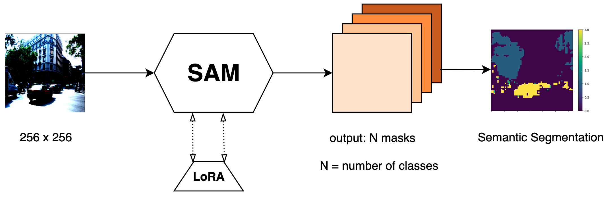
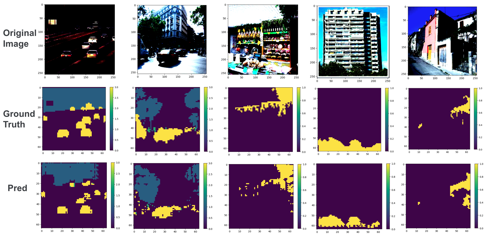
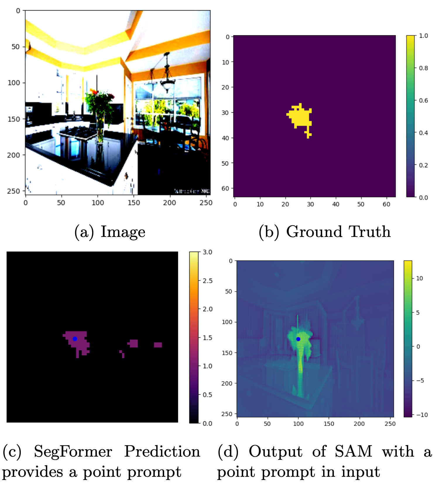
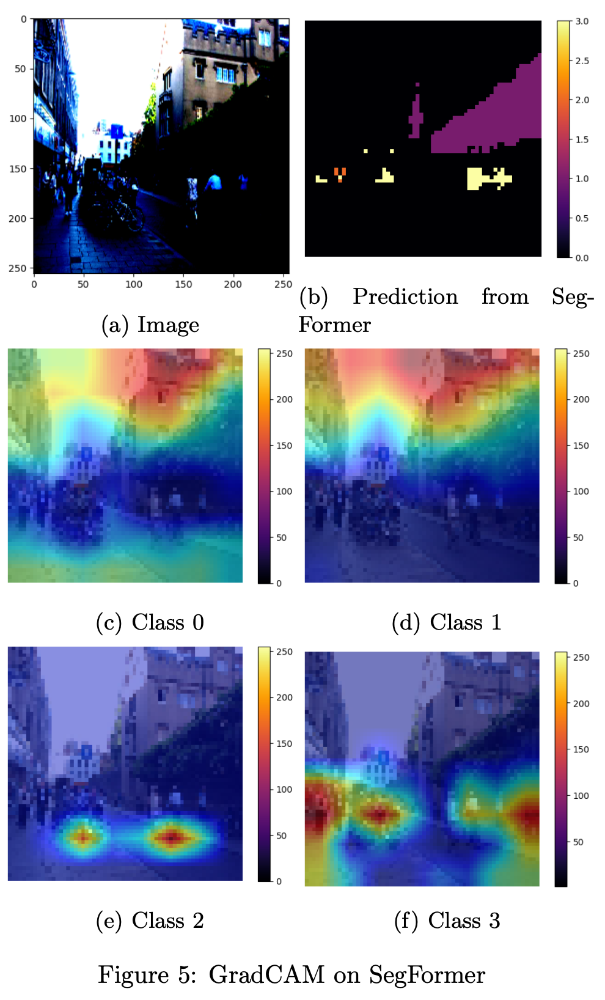

## 

##

**segment-anything-main folder:** Contains the modified code based on the official Segment-Anything-Main (SAM) code. It has been adapted to support various features for our project including Multiple Mask Outputs for Semantic Predictions, Pretrained Checkpoint Loading to Different Architectures, and Position Encoding Adjustments for Low Resolution Input.

**sam_lora.py:** Contains code for LoRA fine-tuning.

**SegFormer Integration:** Files ending with _2 are for SegFormer, which is part of Project 6 in this course.

**Other Python Files:** These files provide additional functions for our method. Jupyter Notebooks: Included for training and producing results.

##

